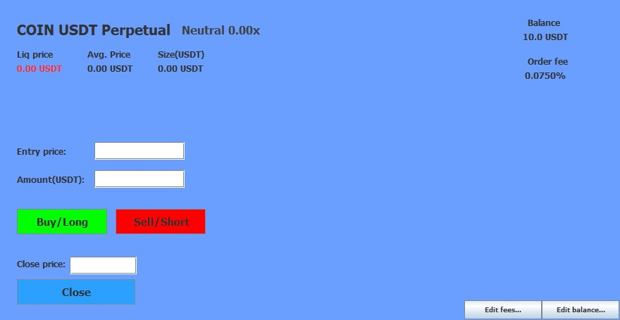
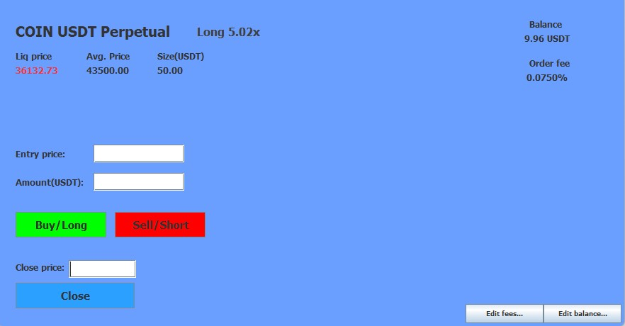
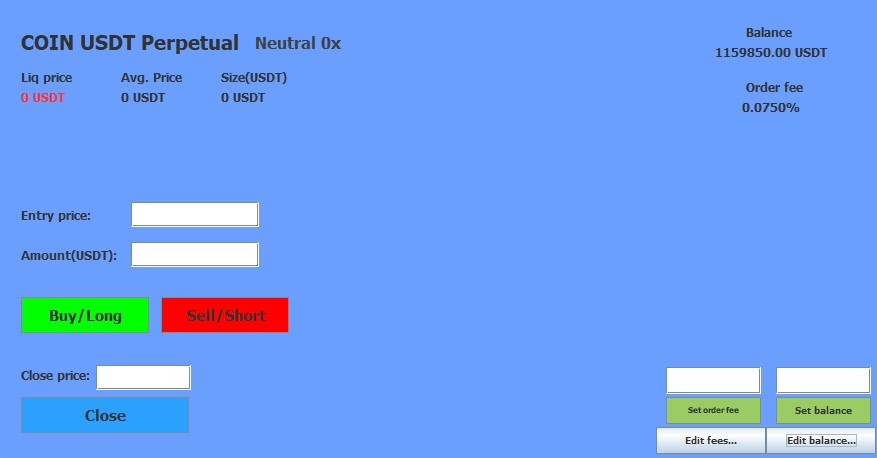

# Trading Simulation Calculator

This trading simulation calculator is a tool designed to help traders analyze their potential profit and loss, risk, and leverage in simulated trading scenarios. It allows users to input their entry and exit points in the market and provides calculations for potential profit or loss based on those parameters.

## Features

- **Risk Calculation**: Calculate the risk associated with a trade based on the entry and stop-loss levels.
- **Leverage Analysis**: Determine the leverage ratio used in a trade to assess the potential impact on profits or losses.
- **Profit and Loss Calculation**: Calculate the potential profit or loss for a given trade based on the entry and exit points.
- **Iterative Simulation**: Conduct iterative simulations by adjusting entry and exit points to explore various trading scenarios.
- **Fees and Balance Adjustment**: Customize trading fees and set an account balance to better grasp the capital management aspects without putting real money at risk.





## How to Use

1. **Installation**: Clone the repository to your local machine.
    ```
    git clone https://github.com/AndreiE91/TradingTracker.git
    ```

2. **Setup**: Set up a new IntelliJ or build the Java project in any other way.
3. 
4. **Usage**: Run the application and follow the on-screen prompts to input your trading parameters.

5. **Simulation**: After inputting the necessary parameters, the application will calculate the potential profit or loss, risk, and leverage for your trade.

## Contributing

Contributions are welcome! If you have any ideas for improvements or new features, feel free to open an issue or submit a pull request.
